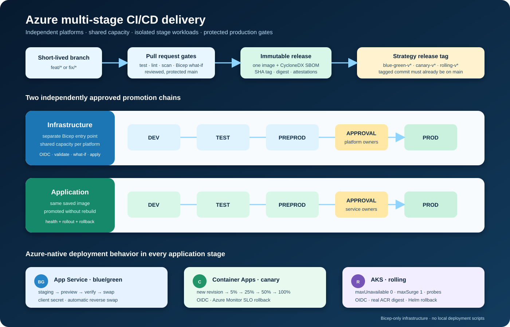

# Azure multi-stage CI/CD deployment strategies

This repository is a production-oriented reference implementation for three
Azure-native deployment strategies. Its default `developer` infrastructure
profile is deliberately cost-minimized for a demonstration subscription; the
configurable `production` profile restores resilient capacity. Infrastructure
is deployed only through GitHub Actions and Bicep; application delivery is
never performed by a local deployment script.

| Strategy   | Azure target             | Release mechanism                                                                     | Application authentication |
| ---------- | ------------------------ | ------------------------------------------------------------------------------------- | -------------------------- |
| Blue/green | Azure App Service        | Staging slot, swap preview, health verification, swap and rollback                    | Client secret              |
| Canary     | Azure Container Apps     | Immutable revisions, weighted traffic, synthetic samples, SLO gates and rollback      | GitHub OIDC                |
| Rolling    | Azure Kubernetes Service | Required-value Helm chart, Kubernetes `RollingUpdate`, server validation and rollback | GitHub OIDC                |

Three user-facing workflows own the repository lifecycle: CI, infrastructure
and application delivery. Platform jobs remain independent inside the shared
orchestrators, and every deployment progresses sequentially through
`dev → test → preprod → prod`. Infrastructure and application production jobs
use separate protected GitHub Environments and approval gates.



## What the pipelines actually do

Infrastructure workflow:

- A pull request compiles Bicep and runs Azure validation and `what-if` through
  a plan-only GitHub Environment.
- A merge to protected `main`, or an approved manual platform selection,
  creates and updates dev, test, preprod and prod workloads in sequence.
- Each platform owns one resource group, shared chargeable capacity and four
  stage-isolated workloads. App Service and Container Apps use separate
  subscription-scope foundation and workload entry points so their private ACR
  exists before the first scanned image is published.
- Production waits at `infra-<platform>-prod` before Azure login or deployment.

Application Delivery workflow:

- A protected release tag starts the selected strategy.
- Tests, linting, container build, Trivy policy scan and CycloneDX SBOM
  generation happen once.
- The exact same saved container image is promoted through all four stages; it
  is not rebuilt between environments.
- Dev publishes the image by commit SHA to the selected platform ACR. Test,
  preprod and prod reuse that exact immutable registry digest.
- GitHub build-provenance and SBOM attestations are published beside the image.
- Production waits at `app-<platform>-prod` before authentication, image push
  or deployment.

| Workflow                   | Trigger                                                | Purpose                                    |
| -------------------------- | ------------------------------------------------------ | ------------------------------------------ |
| `ci.yml`                   | Pull request or push to `main`                         | Test, lint, build, scan and compile IaC    |
| `infrastructure.yml`       | IaC PR, merge to `main`, or approved platform dispatch | Preview or deploy affected Azure platforms |
| `application-delivery.yml` | Protected strategy tag                                 | Build once and promote through four stages |

Infrastructure workflow-dispatch runs and release tags are rejected unless
their commit is already contained in `main`. Application delivery is tag-only
because its GitHub Environments accept only their protected strategy tags.

## Azure deployment profiles

Set the same `AZURE_DEPLOYMENT_PROFILE` Environment variable everywhere a
platform is deployed. Allowed values are `developer` and `production`; Bicep
and the AKS Helm delivery default to `developer` when the variable is absent.
Do not mix profiles between a platform's infrastructure and AKS application
Environments.

| Cost driver               | `developer` default                                  | `production`                                                 |
| ------------------------- | ---------------------------------------------------- | ------------------------------------------------------------ |
| App Service               | P0v4, one worker, no zone redundancy                 | P0v3, two workers, zone redundant                            |
| ACR per platform          | Basic                                                | Standard                                                     |
| Log Analytics             | 1 GB/day cap; optional platform diagnostics disabled | No daily cap; full platform diagnostics                      |
| Container Apps            | Non-zonal; scale 0–2                                 | Zone redundant; non-prod 1–2, prod 2–5                       |
| AKS system pool           | One `Standard_D2s_v4` node; fixed size; non-zonal    | Three `Standard_D4ds_v5` nodes; autoscale to five; zones 1–3 |
| AKS application per stage | One replica; HPA 1–2; no PDB                         | Four replicas; HPA 4–20; PDB minimum 3                       |

Both profiles still create only three platform resource groups, one ACR and one
Log Analytics workspace per platform, and four stage-isolated workloads. P0v4
retains the staging slot needed for the blue/green demonstration and is the
selected lower-cost UK South developer SKU. The one-node AKS profile is not
highly available; it exists to demonstrate a rolling update at the lowest
practical compute floor. Stop the AKS cluster with `az aks stop` when the demo
is idle and start it before delivery; disks and network resources can still
incur small charges while stopped.

Choose the profile before the first deployment to a target. Moving an existing
AKS node pool between VM families or enabling Container Apps zone redundancy
is not an in-place sizing operation; use reviewed `what-if` output and a planned
migration or recreation instead of treating a profile change as a safe toggle.

Stage isolation is logical inside each platform resource group: separate web
apps, Container Apps and AKS namespaces retain independent application state,
RBAC and approval history. A real production landing zone should expand the
same modules into separate subscriptions or resource groups and increase
capacity; it should not copy the developer subscription's shared failure
domain.

The shared Bicep modules are implementation reuse only. `infrastructure.yml`
orchestrates selected platforms, but each platform still has an independent
Bicep deployment, resource group, environment chain and failure boundary.

## Observe each strategy in the application

The public application is a live strategy dashboard, not a generic placeholder.
Every deployment injects its strategy and lifecycle stage. The page displays:

- Azure platform and active strategy;
- the exact strategy flow being exercised;
- current stage and serving release SHA;
- App Service worker, Container Apps revision or AKS pod identity;
- a two-second observation history of the instances and releases serving real
  requests.

During a canary, repeated observations can show stable and candidate revisions
according to the active traffic weight. During an AKS rollout, pod identities
change progressively while the release remains available. A blue/green
deployment changes the visible release at the slot swap boundary. The same data
is available from `/deployment`, with health probes at `/health/live` and
`/health/ready`.

App Service and Container Apps expose HTTPS ingress. AKS non-production stages
use ClusterIP and are verified through authenticated `kubectl port-forward`;
only production creates a public Azure Load Balancer. The chart has no default
image or service type: schema validation requires the real Bicep-provisioned
ACR repository, promoted digest and stage-appropriate exposure supplied by CI.
Production public access is intentional so the strategy behavior can be tested
rather than merely provisioned.

## Start here: prerequisites

Do not open the infrastructure pull request until these control-plane
prerequisites are complete:

1. Confirm the tenant, subscription, supported Azure region and three shared
   platform resource-group names.
2. Register the required Azure providers and confirm policy, regional SKU and
   quota availability.
3. Confirm the two-phase private-ACR flow: foundation creates the registry and
   pull/publisher identities, CI publishes the scanned build, and workload Bicep
   receives the immutable ACR digest. No public bootstrap package is required.
4. Create the 27 GitHub Environments and their protection rules: three
   production plan Environments, 12 infrastructure Environments and 12
   application Environments.
5. Deploy the repository's identity bootstrap Bicep to create six OIDC managed
   identities and 23 exact environment-bound federated credentials. Create one
   App Service service principal for the client-secret demonstration.
6. Store only the documented variables and secrets in their matching GitHub
   Environments, then protect `main` and the three release-tag patterns.

The selected tenant, subscription and resource names are deliberately not
stored in this public repository. The developer AKS profile uses 2 DSv4-family
vCPUs normally and needs 4 during an upgrade with one surge node. The production
profile uses 12 DDSv5-family vCPUs normally, 20 at its autoscaling maximum and
24 during a maximum-size upgrade with one surge node. Verify quota for the
selected profile before opening the infrastructure pull request.

The authoritative checklist is [Azure and GitHub setup](docs/azure-setup.md).
It includes every Environment name, variable, secret, OIDC subject, identity
bootstrap parameter, RBAC boundary, approval gate and validation check.

## First end-to-end run

Follow this order:

1. Complete the prerequisite checklist and the Azure/GitHub identity bootstrap.
2. Open the feature pull request. Only same-repository pull requests can run
   the Infrastructure preview matrix; approve the selected plan Environments.
3. Review CI and all three Bicep what-if results, then squash-merge into
   protected `main`.
4. Let dev and test infrastructure complete, approve preprod, then approve the
   separate production infrastructure gate for App Service, Container Apps and
   AKS.
5. From that `main` commit, create the protected baseline tags
   `blue-green-v1.0.0`, `canary-v1.0.0` and `rolling-v1.0.0`, preferably one at
   a time.
6. Merge a visible application change and create the corresponding `v1.0.1`
   tags. Keep each public dashboard open to observe the slot swap, weighted
   revisions and progressive pod replacement.

The pipeline, not a workstation script, creates all application infrastructure
and performs every deployment. Subscription registration, quota approval,
identity trust and GitHub configuration are prerequisites because they establish
the authority CI/CD needs; they do not replace Bicep-managed platform resources.

## Repository layout

```text
.github/workflows/
  ci.yml                              Pull-request and main quality gates
  infrastructure.yml                  Platform previews and infrastructure delivery
  application-delivery.yml            Build-once application promotion
.github/actions/
  infra-stage/                        Bicep validate/what-if/apply component
  infrastructure-platform-stage/      Platform infrastructure router
  private-acr-infra-stage/            Foundation, private publish and workload component
  build-release/                      Build/scan/SBOM immutable image once
  publish-image/                      ACR digest and attestations component
  application-stage/                  Deployment-strategy router
  app-service-stage/                  Slot deployment component
  container-apps-stage/               Weighted canary component
  aks-stage/                          Controlled rolling component
infra/
  bootstrap/                          OIDC identity and federation Bicep
  app-service/                        Independent App Service entry point/module
  container-apps/                     Independent Container Apps entry point/module
  aks/                                Independent AKS entry point/module
  modules/                            Shared ACR and Log Analytics modules
deploy/aks/chart/                     Required-value Helm chart for the AKS workload
src/server.js                         HTTP application and health endpoints
test/                                 Unit and endpoint tests
Dockerfile                            Pinned, non-root production container
```

## Branching and releases

Use trunk-based development:

1. Branch from current `main` with a short-lived name such as
   `feat/azure-multi-stage-delivery`.
2. Open a pull request and require CI plus the affected infrastructure plan.
3. Require review, signed commits where policy permits, conversation resolution
   and a current branch before squash merging.
4. Disallow direct pushes, force pushes and deletion of `main`.
5. Create a signed, protected strategy tag from a commit already on `main`.

Long-lived `develop`, `test` and `release` branches are intentionally not used.
Azure lifecycle stages are deployment environments, not source-code branches.

## Local verification

Local commands only verify source. They do not deploy Azure resources or
applications.

```bash
npm ci
npm run lint
npm test
docker build -t delivery-demo:local .
az bicep build --file infra/app-service/main.bicep
az bicep build --file infra/app-service/workload-main.bicep
az bicep build --file infra/container-apps/main.bicep
az bicep build --file infra/container-apps/workload-main.bicep
az bicep build --file infra/aks/main.bicep
az bicep build --file infra/bootstrap/main.bicep
trunk check .github/workflows/ci.yml --no-fix --print-failures
trunk check src/server.js test/server.test.js --no-fix --print-failures
```

Run Trunk against explicit files in small, type-compatible batches; do not use a
repository-wide check for this project.

## Security boundaries

- Third-party actions are pinned to full commit SHAs.
- GitHub's required `.github/workflows` directory contains only the three
  user-facing workflows; reusable implementation is grouped under
  `.github/actions`.
- Only deployment jobs receive Azure credentials, OIDC tokens and attestation
  permissions.
- Infrastructure plan jobs require approval, use ARM's non-RBAC validation
  mode and reject pull requests from forks before Azure authentication.
- Runtime services use managed identity for ACR pulls; registry passwords are
  disabled.
- Production jobs never cancel an in-progress deployment.
- Resource names are discovered inside the dedicated resource group by Bicep
  tags, avoiding duplicated deployment outputs in GitHub configuration.
- The App Service client secret exists only as an environment secret and is
  never committed, printed, passed as a command-line parameter or stored in an
  artifact.

Public endpoints keep this reference observable from GitHub-hosted runners and
a browser. A private enterprise variant should add TLS ingress, private
endpoints and hardened, ephemeral self-hosted runners inside the Azure network.

## References

- [Azure App Service deployment slots](https://learn.microsoft.com/azure/app-service/deploy-staging-slots)
- [Azure Container Apps traffic splitting](https://learn.microsoft.com/azure/container-apps/traffic-splitting)
- [Azure Container Apps health probes](https://learn.microsoft.com/azure/container-apps/health-probes)
- [AKS application and cluster reliability](https://learn.microsoft.com/azure/aks/best-practices-app-cluster-reliability)
- [GitHub Actions OIDC for Azure](https://docs.github.com/actions/how-tos/secure-your-work/security-harden-deployments/oidc-in-azure)
- [GitHub secure use reference](https://docs.github.com/actions/security-for-github-actions/security-guides/security-hardening-for-github-actions)
